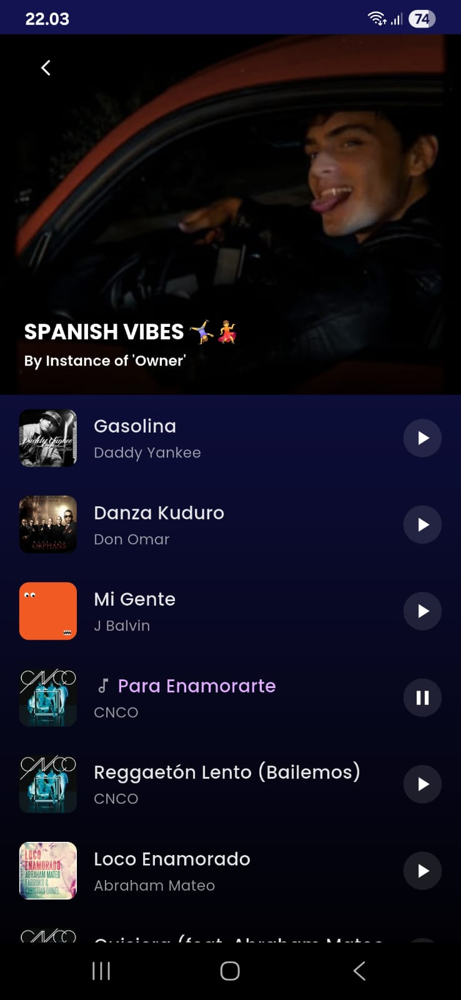
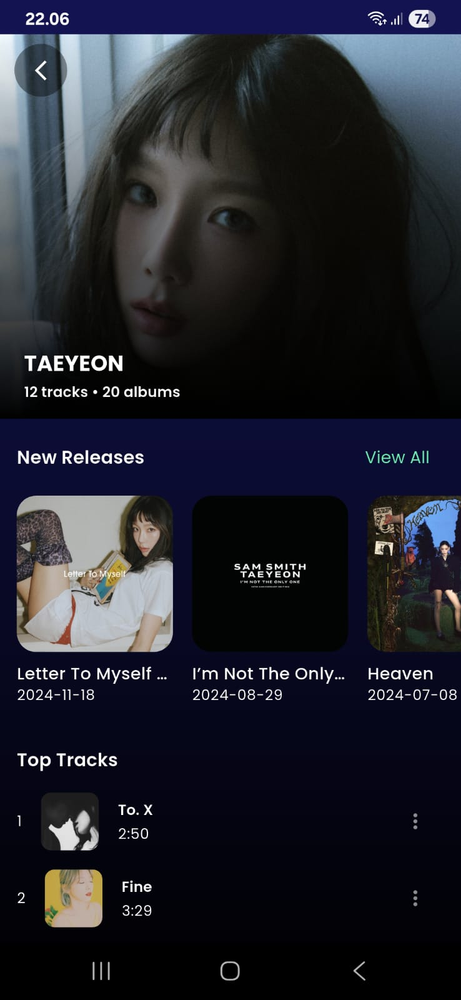
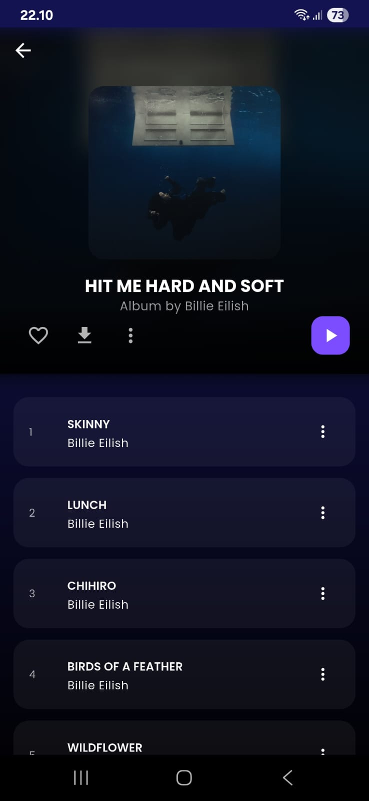
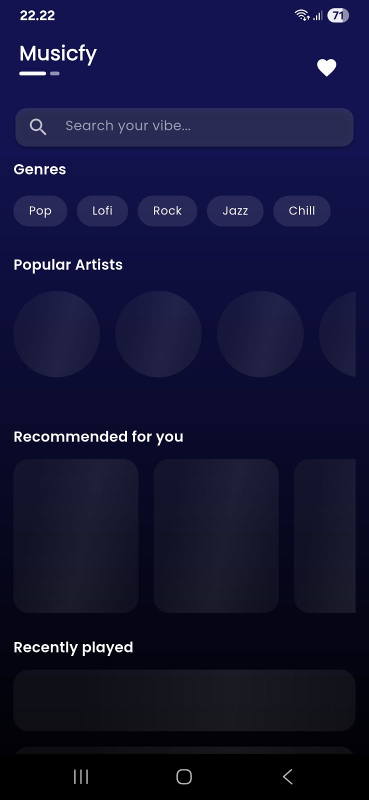

# 🎵 Muscify Application

**Muscify** is a music streaming application built with **Flutter**, designed to experiment with and implement the **Spotify Web API**.  
The application allows users to explore music data, stream previews, view artist and playlist information, and manage their favorite tracks locally.

---

## 📌 Purpose

The primary goal of this project is to **explore and implement the Spotify API** within a Flutter application environment.  
It serves as a learning and development project to understand:

- How to integrate third-party APIs into mobile applications.
- Best practices for **state management** and **data persistence** in Flutter.
- Building responsive and user-friendly **UI/UX** for music streaming applications.

---

## 🚀 Features

- Browse music, playlists, album, and artist information from Spotify.
- Play song previews directly within the app.
- View detailed track and artist pages.
- Save and manage favorite songs locally.
- Smooth animations and loading effects for enhanced user experience.

---

## 🛠️ Technologies & Dependencies

### **Framework & Language**
- **Flutter (Dart)**

### **Core Dependencies**
- **dio** — For handling HTTP requests to the Spotify API.
- **google_fonts** — Custom typography integration.
- **shared_preferences** — Store small data like app settings.
- **provider** — State management.
- **shimmer** — Loading skeleton effect.
- **hive** & **hive_flutter** — Local NoSQL database for storing favorites.
- **path_provider** — File path management.
- **marquee** — Scrolling text for song titles.
- **get_it** — Dependency injection.
- **cached_network_image** — Image caching.
- **flutter_dotenv** — Environment variable management for API keys.

### **Dev Dependencies**
- **hive_generator** — Code generation for Hive models.
- **build_runner** — Runs code generation tasks.

---

## 📸 Screenshots

<p float="left">
  
  
  
  
  
  
  
</p>

---

## ⚙️ Installation

### **Prerequisites**
- [Flutter SDK](https://docs.flutter.dev/get-started/install) installed.
- A valid **Spotify API key** and credentials from the [Spotify Developer Dashboard](https://developer.spotify.com/dashboard).

### **Steps**
1. **Clone this repository**
    ```bash
    git clone https://github.com/gebyginting/Musicfy-App.git
    cd Musicfy-App
    ```

2. **Install dependencies**
    ```bash
    flutter pub get
    ```

3. **Create a `.env` file in the project root and add your Spotify credentials:**
    ```env
    SPOTIFY_CLIENT_ID=your_client_id
    SPOTIFY_CLIENT_SECRET=your_client_secret
    ```

4. **Run the app**
    ```bash
    flutter run
    ```

---

## 🙋‍♂️ Author

Developed by **Geby Ginting**  
📧 gebygintingg@gmail.com  
🔗 [LinkedIn – Geby Ginting](https://www.linkedin.com/in/geby-ginting)
